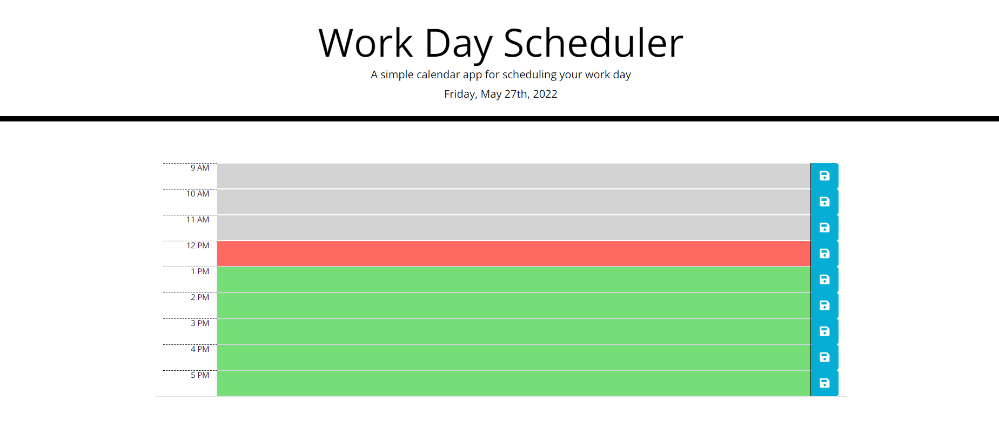

# Work-Day-Scheduler

This project was designed as an assignment for Module 5 : Third Party API

This application was designed using HTML, CSS, Javascript and THird Party API's. It emphasizes the use of Third Party API's to make designing more efficient and fast.

## Links:

[GitHub Repository](https://github.com/Pooja3093/Work-Day-Scheduler.git)

[Deployed Application](https://pooja3093.github.io/Work-Day-Scheduler/)

[Full Demo Video](https://drive.google.com/file/d/1dzpRVwsrqGKzYGbsEeF1vPsXi-kgwDrx/view)

## Summary
This is a standard office hour scheduler, starting from 9 AM to 6 PM (last hour added just for miscellaneous tasks, if any).

Every time slot is of 1 hour length.

For each time slot a text area is provided to enter tasks to be completed. A save button is also provided to save this data.

Once a save button is clicked, the data in the corresponding text box will be saved to the local storage alongside the number of the box.

When the application is refreshed, the program will retrieve this data from the local storage and populate the appropriate fields. This way user will never lose his data.

Also the text-boxes are color coded depending on the time. The current hour box is colored red, future boxes are colored green and the past ones are colored grey. This will help the user to track their day better visually.

## Features:

* Save buttons
* Real-time date and time
* Color coded time slots
* Local storage of schedule
* Event listners (on-click)

## Screenshot:

